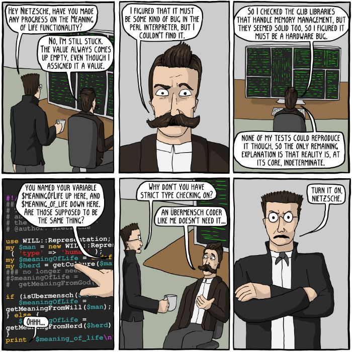

# Tooling

Or, how to get the computer to help you.

(From the fantastic [Existential Comics](http://existentialcomics.com/comic/86))

Some of us are Ubermensch coders; the rest of us are human, and can use all the help
we can get.

One of the key ideas of the [previous section](style.md) was to encode as much
information into the structure of the programming language as you could, rather
than as comments, docs etc. which are somehow "external".  This is more easily done
in a _static_ language like Java or C++ (or even a pure functional language such as
_haskall_).  Python is _dynamic_ and allows you to shoot yourself in the foot more
(see [We're all responsible users](http://docs.python-guide.org/en/latest/writing/style/#we-are-all-responsible-users) aka [We're all consenting adults](https://github.com/kennethreitz/python-guide/issues/525)).

Going beyond this is the idea of [tooling](https://en.wikipedia.org/wiki/Programming_tool): the software tools you use when coding.

# Editors

In the live version of this talk, I used [VSCode](https://code.visualstudio.com/) with the [Python Language extension](https://github.com/DonJayamanne/pythonVSCode).  You can just use a text editor to write Python, of course.  But using some form of
[IDE](https://en.wikipedia.org/wiki/Integrated_development_environment) can greatly speed up coding.  I find especially useful:

- Auto complete.  (I don't have to type out long variable names anymore!)
- Access to class/package members.  (I know `numpy` can do this, but I don't remember what the function is called.  Type `np` and press `ctrl-space` and I see a list...)
- Documentation lookup.  (What do the parameters mean?  Hover the mouse over and see.)
- Syntax highlighting.  Just having a visual clue as to what's a keyword, and what's a variable, really makes scanning code easier.

Notice that these tools allow me to follow my "best practises" better.  I can type long variable names quickly.  I can write documentation for myself, and see it automatically,without having to open the source code.

# For the future

- Linting tools
- Continuous integration
